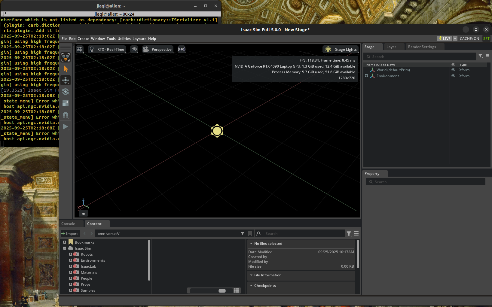
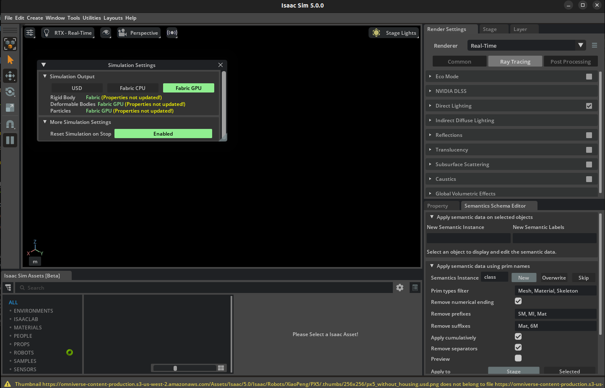
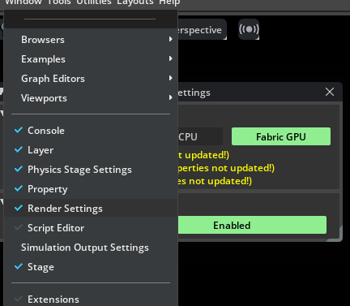

# Isaac Sim and Isaac Lab Installation

## My PC Setup
* 型号 Alienware m16 R1
* GPU: RTX4090 Laptop 16G
* CPU: i9-13900HX * 32
* RAM: 64GB
* ROM: 500GB
* Ubuntu 22.04
* Conda (隔离系统和Isaac需要的Python环境)
* GPU Driver: 580 (直接在Ubuntu Additional Driver里选的)
* CUDA: 12.4 (5.0.0及更新的Isaac Sim官方推荐搭配Cuda 12使用)

Notes:
1. Isaac Sim目前只能在RTX GPU上安装，暂不支持在H100等科学计算卡上使用。原因是Isaac sim的仿真环境需要光线追踪和视频输出。目前暂不清楚如何用H100加速强化学习的训练。
2. **请不要改变Ubuntu原生的python版本。**Ubuntu系统的一些功能和原生的Python版本绑定，如果覆盖了native python可能导致系统功能异常（例如无法打开terminal）。而Isaac工具包也依赖于特定版本的python（3.11）。以防两者存在兼容问题，推荐在虚拟环境或者conda中创建Isaac需要的软件环境。

## Install Isaac Sim
分别测试了[Pre-built Binaries](https://isaac-sim.github.io/IsaacLab/main/source/setup/installation/binaries_installation.html)和[Pip Package](https://isaac-sim.github.io/IsaacLab/main/source/setup/installation/pip_installation.html#). Pre-built方式启动Isaac sim经常崩掉，并且命令行很快自动退掉了所以也看不清问题是什么。使用Pip在conda环境中安装后启动正常，目前没有发现问题。**这里以Pip安装方式为例。**

安装的Isaac Sim 版本为 5.0.0。根据Nvidia官方文档说Isaac Sim 4.5.0及之前的版本是通过Omniverse安装，从5.0.0之后则是作为单独的软件包安装。两者对于系统环境的要求可能有差别。
### Create Conda Environment
```bash
conda create -n env_isaaclab python=3.11 # python版本必须是3.11, 否则后面会报错
conda activate env_isaaclab

pip install --upgrade pip # 升级conda环境中的pip
```
### Installing dependencies 
Install Pytorch with CUDA
```bash
pip install torch==2.7.0 torchvision==0.22.0 --index-url https://download.pytorch.org/whl/cu128 # --index-url 不能省略，否则安装的是CPU版本
```
Install Isaac Sim
```bash
pip install "isaacsim[all,extscache]==5.0.0" --extra-index-url https://pypi.nvidia.com
```
### Verifying the Isaac Sim Installation
```bash
# 1. activate conda virtual environment
conda activate
# 2. run isaac sim.
#    The first running takes more time. 
isaacsim
```
看到如下界面，并且右上角的FPS等参数在变化，说明Isaac Sim正常启动了。Congratulation!


## Install Isaac Lab
和Isaac Sim一样， Isaac Lab同样提供了Linux和Windows两种环境下的安装流程。Linux支持的强化学习训练框架更多（例如robomimic）。对于两个系统都支持的训练框架（例如rsl_rl）目前没有发现有明显差异。可以综合考虑其他开发工具的需求，选择合适的平台安装。以下采用了Linux平台安装流程。

1. Clone Isaac Lab repository
```
git clone https://github.com/isaac-sim/IsaacLab.git
```
2. 安装依赖
```bash
# This step is only for Linux
sudo apt install cmake build-essential
```
3. 运行安装脚本
```bash
# 需要在之前创建的conda环境中进行
# 安装脚本在第1步的repo路径下
# 这一步会安装所有可用的训练框架：
# rl_games, rsl_rl, sb3, skrl, robomimic
./isaaclab.sh --install # or "./isaaclab.sh -i"
```
### Verify The Isaac Lab Installation
```bash
# Option 1: Using the isaaclab.sh executable
# note: this works for both the bundled python and the virtual environment
./isaaclab.sh -p scripts/tutorials/00_sim/create_empty.py

# Option 2: Using python in your virtual environment
python scripts/tutorials/00_sim/create_empty.py
```
运行Option2，看到如下画面，且能看到simulation settings（Window -> Simulation Output Settings），说明Isaac Sim正常启动了。Congratulation!



到这里，Isaac Sim和Isaac Lab就都准备好了！🎉下面可以开始尝试一些简单的机器人训练，看看功能是否都正常🤖